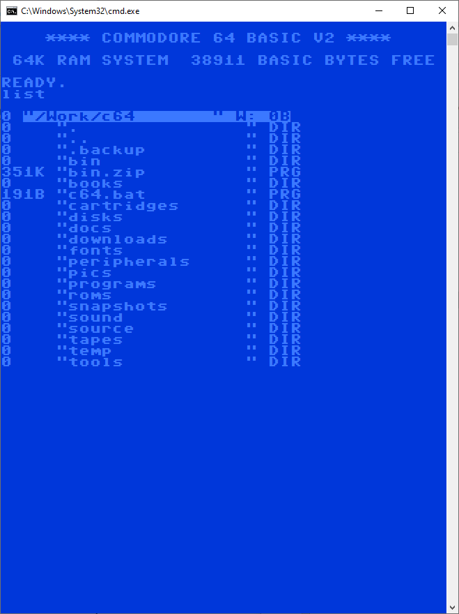

# c64 style LIST command for the PC

------------------------------------------------------------ 
<b>Notes:</b> 
------------------------------------------------------------ 

- Compiled with Visual Studio 2017 

- Settings are only for "Release/x64", if you want to compile for other targets, 
you need to make sure you have the correct settings/pathnames copied from the "Release/x64" target 

- By default, the .exe is copied to the ./bin folder as "c64_list_win.exe". 
I renamed it to "list.exe" and copied it to my path for convinience. 

------------------------------------------------------------ 
<b>Terminal:</b> 
------------------------------------------------------------ 

In order to get a more authentic experience, i modified my default terminal window as follows: 

- Install the supplied truetype font "C64_Pro_Mono-STYLE.ttf" on your system (Control Panel/Fonts) 

In the terminal settings: 

- Select the font and use size 16 
- Set screen buffer width to 40 and height to 9999 
- Set window size width to 40 and height to 50 (or 25 if you want a more c64-ish experience) 
- Set screen background to the 2nd color (dark blue) 
- Set screen text to the 4th color (lighter blue) 
- Set cursor shape to Solid Box 
- Make sure the cursor color matches your foreground color 

- Optionally, you can also run the supplied batch file "c64.bat" (You need to edit the drive and path in the file) to get a c64 startup screen 

------------------------------------------------------------ 
<b>Display:</b> 
------------------------------------------------------------ 

- The title bar shows the current path (truncated to 16 chars) followed by the drive letter and the hex length of the path name (max of FF) 

- File sizes are displayed in B(ytes), K(ilobytes), M(egabytes), G(igabytes), T(errabytes) 

- File names are turncated at 16 chars, a ">" after a file name indicates that the name was truncated 

- Currently only two file types are displayed, "DIR" for directories and "PRG" for everything else 

